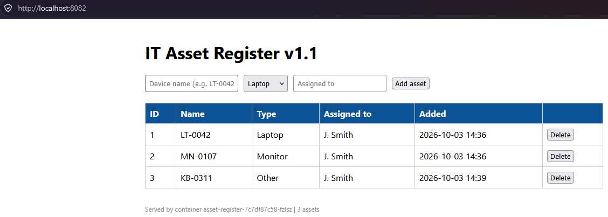

# Lab 04: The Asset Register and PostgreSQL

## Overview

| | |
|---|---|
| **Goal** | Run my Asset Register app and its PostgreSQL database on Kubernetes, then test that the data survives, the app waits for the database, and a broken release never reaches users |
| **Runs on** | Docker Desktop's built-in Kubernetes, on my laptop |
| **Cost** | Free |
| **Time** | About 90 minutes |

Labs 01 to 03 used test images. This time I ran a real application: the IT Asset Register from my [Docker project](https://github.com/iM-MQ/docker-asset-register), using the exact image my GitHub Actions pipeline published, pinned to its commit. The app needs a database, a password, settings and storage that outlives the pods, so this lab brings in the Kubernetes objects for each of those.

```
 Browser ──► Service "asset-register" (LoadBalancer, localhost:8082)
                 │
     ┌───────────┼───────────┐
    Pod         Pod         Pod          Asset Register (3 copies)
     └───────────┼───────────┘
                 ▼
           Service "postgres" (ClusterIP, inside the cluster only)
                 │
                Pod                      PostgreSQL 16
                 │
           PersistentVolumeClaim         1Gi, survives the pod being replaced

 ConfigMap "asset-config" ─► settings for both      Secret "asset-db" ─► password for both
```

### From Compose to Kubernetes

Every part of my `compose.yaml` has a Kubernetes equivalent:

| In Docker Compose | In Kubernetes |
|---|---|
| `DB_HOST`, `DB_NAME`, `DB_USER` | ConfigMap `asset-config` |
| `POSTGRES_PASSWORD` / `DB_PASSWORD` | Secret `asset-db` |
| `dbdata` named volume | PersistentVolumeClaim `postgres-data` |
| `depends_on: condition: service_healthy` | An init container, `wait-for-postgres` |
| `pg_isready` healthcheck | Readiness and liveness probes on Postgres |
| Dockerfile `HEALTHCHECK` on `/health` | Readiness and liveness probes on the app |
| `backend` network with `internal: true` | A ClusterIP Service, reachable only inside the cluster |
| `127.0.0.1:8080:5000` | A LoadBalancer Service on `localhost:8082` |
| `mem_limit` | CPU and memory requests and limits |

---

## Following along?

- I ran every command in **PowerShell** from `C:\kubernetes-labs`, using the terminal inside **VS Code**.
- Each command is in its own box. Run **one line at a time**.
- Boxes marked **What I saw** show my output. They are not commands to run.
- Pod names, IP addresses and volume names will differ on your machine.
- Commands ending in `-w` keep watching. Press **Ctrl + C** to get the prompt back once you have seen what you need.
- The image is public on GitHub Container Registry, so no sign-in is needed to pull it.

See the [main README prerequisites](../README.md#prerequisites), and Labs [01](../lab-01-first-cluster), [02](../lab-02-deployments) and [03](../lab-03-services) for the basics.

---

## The manifests

The password is the one thing not in a file. I created it with a command (Step 1) so it never goes near Git.

### `configmap.yaml`

```yaml
apiVersion: v1
kind: ConfigMap
metadata:
  name: asset-config
  labels:
    app: asset-register
data:
  DB_HOST: postgres
  DB_NAME: assets
  DB_USER: assetapp
```

`DB_HOST: postgres` is the name of the database Service. CoreDNS turns that name into the Service's IP, as in Lab 03.

### `pvc.yaml`

```yaml
apiVersion: v1
kind: PersistentVolumeClaim
metadata:
  name: postgres-data
  labels:
    app: asset-register
spec:
  accessModes:
    - ReadWriteOnce
  resources:
    requests:
      storage: 1Gi
```

| Part | Meaning |
|---|---|
| `PersistentVolumeClaim` | A request for storage. The cluster's StorageClass creates the actual volume |
| `ReadWriteOnce` | Only one node can mount it at a time, which suits a single database |
| No `storageClassName` | Uses the cluster's default, which on Docker Desktop is `hostpath` |

### `postgres.yaml`

```yaml
apiVersion: apps/v1
kind: Deployment
metadata:
  name: postgres
  labels:
    app: postgres
spec:
  replicas: 1
  strategy:
    type: Recreate
  selector:
    matchLabels:
      app: postgres
  template:
    metadata:
      labels:
        app: postgres
    spec:
      containers:
        - name: postgres
          image: postgres:16-alpine
          ports:
            - containerPort: 5432
          env:
            - name: POSTGRES_DB
              valueFrom:
                configMapKeyRef:
                  name: asset-config
                  key: DB_NAME
            - name: POSTGRES_USER
              valueFrom:
                configMapKeyRef:
                  name: asset-config
                  key: DB_USER
            - name: POSTGRES_PASSWORD
              valueFrom:
                secretKeyRef:
                  name: asset-db
                  key: password
            - name: PGDATA
              value: /var/lib/postgresql/data/pgdata
          volumeMounts:
            - name: data
              mountPath: /var/lib/postgresql/data
          readinessProbe:
            exec:
              command: ["sh", "-c", "pg_isready -U \"$POSTGRES_USER\" -d \"$POSTGRES_DB\""]
            initialDelaySeconds: 5
            periodSeconds: 5
          livenessProbe:
            exec:
              command: ["sh", "-c", "pg_isready -U \"$POSTGRES_USER\" -d \"$POSTGRES_DB\""]
            initialDelaySeconds: 30
            periodSeconds: 10
          resources:
            requests:
              cpu: 100m
              memory: 128Mi
            limits:
              cpu: 500m
              memory: 256Mi
      volumes:
        - name: data
          persistentVolumeClaim:
            claimName: postgres-data
---
apiVersion: v1
kind: Service
metadata:
  name: postgres
  labels:
    app: postgres
spec:
  type: ClusterIP
  selector:
    app: postgres
  ports:
    - port: 5432
      targetPort: 5432
```

| Part | Meaning |
|---|---|
| `strategy: Recreate` | A normal rolling update starts the new pod before stopping the old one. Two databases writing the same files would corrupt them, so Recreate stops the old pod first |
| `configMapKeyRef` / `secretKeyRef` | Postgres reads its settings from the ConfigMap and its password from the Secret, so nothing is hard-coded |
| `PGDATA` in a subfolder | Cloud disks such as Azure Disk come with a `lost+found` folder, and Postgres will not set up in a folder that is not empty. Using a subfolder now means the same file works on AKS |
| Readiness probe | The same `pg_isready` check as my Compose healthcheck. The Service only sends traffic once it passes |
| Liveness probe | The same check with a longer delay. If Postgres hangs, the container is restarted |
| `type: ClusterIP` | Internal only, the Kubernetes version of `internal: true` in Compose |

### `app.yaml`

```yaml
apiVersion: apps/v1
kind: Deployment
metadata:
  name: asset-register
  labels:
    app: asset-register
spec:
  replicas: 3
  selector:
    matchLabels:
      app: asset-register
  template:
    metadata:
      labels:
        app: asset-register
    spec:
      initContainers:
        - name: wait-for-postgres
          image: postgres:16-alpine
          command:
            - sh
            - -c
            - until pg_isready -h "$DB_HOST" -p 5432; do echo "waiting for postgres"; sleep 2; done
          envFrom:
            - configMapRef:
                name: asset-config
      containers:
        - name: web
          image: ghcr.io/im-mq/docker-asset-register:295b250c1913f1f0a4afb685b95c44664b962bd3
          ports:
            - containerPort: 5000
          envFrom:
            - configMapRef:
                name: asset-config
          env:
            - name: DB_PASSWORD
              valueFrom:
                secretKeyRef:
                  name: asset-db
                  key: password
          readinessProbe:
            httpGet:
              path: /health
              port: 5000
            initialDelaySeconds: 5
            periodSeconds: 5
          livenessProbe:
            httpGet:
              path: /health
              port: 5000
            initialDelaySeconds: 15
            periodSeconds: 10
          resources:
            requests:
              cpu: 50m
              memory: 64Mi
            limits:
              cpu: 250m
              memory: 128Mi
---
apiVersion: v1
kind: Service
metadata:
  name: asset-register
  labels:
    app: asset-register
spec:
  type: LoadBalancer
  selector:
    app: asset-register
  ports:
    - port: 8082
      targetPort: 5000
```

| Part | Meaning |
|---|---|
| `initContainers` | Runs before the app and keeps checking until Postgres answers. This replaces `depends_on` from Compose |
| `envFrom: configMapRef` | Loads every key in the ConfigMap as an environment variable. It works because the key names match what `app.py` reads |
| `secretKeyRef` | Loads the password from the Secret as `DB_PASSWORD` |
| `httpGet` probes | The same `/health` check as the Dockerfile `HEALTHCHECK`, now run by Kubernetes |
| Image pinned to a commit SHA | The cluster always runs the exact build my pipeline produced, never whatever `latest` happens to be |
| Port 8082 | Avoids 8080, which clashed with Docker Compose in Lab 01 |

The app runs `init_db()` once when it starts, to create its table. That is why the init container matters: if the app starts before Postgres is ready, it crashes.

---

## How I did it

### Step 1: Created the Secret

I created the Secret with a command rather than a file, so the password is never written anywhere in the repository.

```powershell
kubectl create secret generic asset-db --from-literal=password=<your-local-password>
```

```powershell
kubectl describe secret asset-db
```

**What I saw:**

```
Type:  Opaque

Data
====
password:  11 bytes
```

`describe` shows only the size of the value. I then decoded it to see how well it was really protected:

```powershell
[Text.Encoding]::UTF8.GetString([Convert]::FromBase64String((kubectl get secret asset-db -o jsonpath="{.data.password}")))
```

It printed the password in plain text. A Secret is only **base64-encoded, not encrypted**. It keeps the password out of the code, but anyone allowed to read Secrets can read it. On AKS, Azure Key Vault is the stronger option.

### Step 2: Created the ConfigMap

```powershell
kubectl apply -f lab-04-asset-register\configmap.yaml
```

```powershell
kubectl describe configmap asset-config
```

**What I saw:**

```
DB_HOST:
----
postgres

DB_NAME:
----
assets

DB_USER:
----
assetapp
```

These values are shown in plain text, which is fine because none of them are secret.

### Step 3: Created the storage

```powershell
kubectl apply -f lab-04-asset-register\pvc.yaml
```

```powershell
kubectl get pvc postgres-data
```

```powershell
kubectl get pv
```

**What I saw:**

```
NAME            STATUS   VOLUME                                     CAPACITY   ACCESS MODES   STORAGECLASS
postgres-data   Bound    pvc-4630fa3e-d305-4e5a-8a4f-7eb37613efd8   1Gi        RWO            hostpath

NAME                                       CAPACITY   ACCESS MODES   RECLAIM POLICY   STATUS   CLAIM
pvc-4630fa3e-d305-4e5a-8a4f-7eb37613efd8   1Gi        RWO            Delete           Bound    default/postgres-data
```

The claim was `Bound` straight away, because Docker Desktop's `hostpath` StorageClass creates volumes as soon as they are asked for. The reclaim policy is `Delete`: deleting the claim deletes the data with it.

### Step 4: Deployed PostgreSQL

```powershell
kubectl apply -f lab-04-asset-register\postgres.yaml
```

```powershell
kubectl get pods -l app=postgres -w
```

```powershell
kubectl logs deployment/postgres --tail=5
```

```powershell
kubectl get endpointslices -l kubernetes.io/service-name=postgres
```

**What I saw:**

```
postgres-6d5c985b76-bq74k   1/1     Running   0          18s

LOG:  database system was shut down at 2026-10-03 14:32:27 UTC
LOG:  database system is ready to accept connections

NAME             ADDRESSTYPE   PORTS   ENDPOINTS   AGE
postgres-5t9dj   IPv4          5432    10.1.0.40   79s
```

The `was shut down` line is normal on first start: Postgres sets up the database with a temporary server, stops it, then starts properly. I also confirmed the database and user from the ConfigMap existed:

```powershell
kubectl exec deployment/postgres -- psql -U assetapp -d assets -c "\conninfo"
```

### Step 5: Deployed the Asset Register

```powershell
kubectl apply -f lab-04-asset-register\app.yaml
```

```powershell
kubectl get pods -l app=asset-register -w
```

```powershell
kubectl logs deployment/asset-register -c wait-for-postgres
```

```powershell
kubectl get svc asset-register
```

**What I saw:**

```
asset-register-7c7df87c58-q8qdh   0/1     Running   0          11s
asset-register-7c7df87c58-q8qdh   1/1     Running   0          15s

postgres:5432 - accepting connections

NAME             TYPE           CLUSTER-IP     EXTERNAL-IP   PORT(S)
asset-register   LoadBalancer   10.109.71.72   localhost     8082:30152/TCP
```

The pod showed `0/1` until its readiness probe passed, and only then did the Service send it traffic. The init container found Postgres on its first check, because Postgres was already running.

I opened http://localhost:8082, added two assets and they saved. The footer showed which pod served the page.



At this point the Deployment had 1 replica. I scaled it to 3 in Test 3, and updated the file to match in Test 4.

---

## Tests I carried out

### Test 1: The data survives the database pod being replaced

```powershell
kubectl delete pod -l app=postgres
```

```powershell
kubectl get pods -l app=postgres -w
```

```powershell
kubectl describe pod -l app=postgres | Select-String "ClaimName"
```

**What I saw:**

```
pod "postgres-6d5c985b76-bq74k" deleted from default namespace

postgres-6d5c985b76-mfvq8   1/1     Running   0          8s

    ClaimName:  postgres-data
```

A new pod, `mfvq8`, replaced the old one and mounted the same claim. Both assets were still listed. I added a third, `KB-0311`, to prove the app could write to the new pod and that I was not looking at a cached page. The app recovered without any errors, which shows it opens a fresh database connection for each request.

### Test 2: The app waits for the database

I stopped Postgres, then forced a new app pod to start without it.

```powershell
kubectl scale deployment postgres --replicas=0
```

```powershell
kubectl delete pod -l app=asset-register
```

```powershell
kubectl get pods -l app=asset-register
```

```powershell
kubectl logs deployment/asset-register -c wait-for-postgres --tail=4
```

**What I saw:**

```
NAME                              READY   STATUS     RESTARTS   AGE
asset-register-7c7df87c58-fzlsz   0/1     Init:0/1   0          44s

postgres:5432 - no response
waiting for postgres
postgres:5432 - no response
waiting for postgres
```

The app container never started, so it could not crash. Then I brought Postgres back:

```powershell
kubectl scale deployment postgres --replicas=1
```

```powershell
kubectl get pods -l app=asset-register -w
```

```
asset-register-7c7df87c58-fzlsz   0/1     Running   0          72s
asset-register-7c7df87c58-fzlsz   1/1     Running   0          75s
```

The app started by itself with **0 restarts**, and all three assets were still there. Without the init container, `init_db()` would have failed and the pod would have gone into `CrashLoopBackOff`.

### Test 3: Scaling and load balancing

```powershell
kubectl scale deployment asset-register --replicas=3
```

```powershell
kubectl get endpointslices -l kubernetes.io/service-name=asset-register
```

```powershell
1..6 | ForEach-Object { (curl.exe -s http://localhost:8082 | Select-String "Served by").Line.Trim() }
```

**What I saw:**

```
NAME                   ADDRESSTYPE   PORTS   ENDPOINTS
asset-register-2nmfr   IPv4          5000    10.1.0.43,10.1.0.45,10.1.0.46

Served by container asset-register-7c7df87c58-fzlsz | 3 assets
Served by container asset-register-7c7df87c58-mvzqq | 3 assets
Served by container asset-register-7c7df87c58-mppvv | 3 assets
Served by container asset-register-7c7df87c58-mvzqq | 3 assets
Served by container asset-register-7c7df87c58-fzlsz | 3 assets
Served by container asset-register-7c7df87c58-fzlsz | 3 assets
```

All three pods answered, and every one showed the same 3 assets because they share one database. Scaling was safe here because the table already existed, so `init_db()` had nothing to create.

### Test 4: A broken readiness probe

To see what Kubernetes does with a bad release, I changed the readiness probe path in `app.yaml` from `/health` to `/healthz`, which does not exist in the app. In the same edit I changed `replicas: 1` to `replicas: 3`, because I had scaled with a command in Test 3 and the file needed to match, or `apply` would have scaled it back down (the drift lesson from Lab 02).

```powershell
kubectl apply -f lab-04-asset-register\app.yaml
```

**Symptom.** The rollout never finished.

```powershell
kubectl rollout status deployment/asset-register
```

```
Waiting for deployment "asset-register" rollout to finish: 1 out of 3 new replicas have been updated...
```

**Investigation.**

```powershell
kubectl get pods -l app=asset-register
```

```
NAME                              READY   STATUS    RESTARTS   AGE
asset-register-7c7df87c58-fzlsz   1/1     Running   0          42m
asset-register-7c7df87c58-mppvv   1/1     Running   0          40m
asset-register-7c7df87c58-mvzqq   1/1     Running   0          40m
asset-register-f7567474b-mmz79    0/1     Running   0          9m27s
```

The new pod belonged to a new ReplicaSet (`f7567474b`) and had been stuck at `0/1` for over nine minutes.

```powershell
kubectl describe pod asset-register-f7567474b-mmz79 | Select-String "Readiness"
```

```
Readiness:  http-get http://:5000/healthz delay=5s timeout=1s period=5s #success=1 #failure=3
Warning  Unhealthy  5m (x64 over 10m)  kubelet  Readiness probe failed: HTTP probe failed with statuscode: 404
```

```powershell
1..3 | ForEach-Object { (curl.exe -s http://localhost:8082 | Select-String "Served by").Line.Trim() }
```

```
Served by container asset-register-7c7df87c58-fzlsz | 3 assets
Served by container asset-register-7c7df87c58-mppvv | 3 assets
Served by container asset-register-7c7df87c58-mppvv | 3 assets
```

**Root cause.** The probe was asking for `/healthz`, and the app returned 404 Not Found 64 times in a row. Only the old pods were answering users.

The broken pod also had **0 restarts**. Only the readiness probe was wrong. The liveness probe still checked `/health`, so Kubernetes knew the container was alive and left it running, just without traffic.

| Probe | What happens when it fails |
|---|---|
| Readiness | The pod is removed from the Service. No traffic, but no restart |
| Liveness | The container is restarted |

**Fix.** I corrected the path in the file and applied it again, rather than using `kubectl rollout undo`. As I found in Lab 02, undo fixes the cluster but not the file.

```powershell
kubectl apply -f lab-04-asset-register\app.yaml
```

```powershell
kubectl rollout status deployment/asset-register
```

```
deployment "asset-register" successfully rolled out

asset-register-7c7df87c58-fzlsz   1/1     Running       0          44m
asset-register-7c7df87c58-mppvv   1/1     Running       0          42m
asset-register-7c7df87c58-mvzqq   1/1     Running       0          42m
asset-register-f7567474b-mmz79    0/1     Terminating   0          11m
```

I expected three new pods, but Kubernetes kept the original three. With the path fixed, the pod template matched the original ReplicaSet (`7c7df87c58`) exactly, so Kubernetes scaled the broken ReplicaSet to zero and reused the healthy one. Nothing restarted and users saw no change.

**Lesson.** A readiness probe stops a broken release from ever receiving traffic. The rollout stalled safely instead of causing an outage.

---

## Issues I hit and how I fixed them

### PowerShell rejected a placeholder

**Symptom.** A `describe` command failed before it reached Kubernetes:

```
The '<' operator is reserved for future use.
```

**Root cause.** I had run the command with a placeholder, `<name-of-the-pod>`, still in it. PowerShell treats `<` as a special character.

**Fix.** I replaced the placeholder with the real pod name from `kubectl get pods`.

**Lesson.** Replace every placeholder before running a command, including the angle brackets.

---

## Clean up

`kubectl delete` accepts a folder, so one command removed everything the manifests created:

```powershell
kubectl delete -f lab-04-asset-register
```

The Secret was created with a command, so it needed removing separately:

```powershell
kubectl delete secret asset-db
```

Because the reclaim policy is `Delete`, removing the claim also deleted the volume and the data on it.

---

## Command reference

| Command | What it does |
|---|---|
| `kubectl create secret generic <name> --from-literal=<key>=<value>` | Creates a Secret without writing it to a file |
| `kubectl describe secret <name>` | Shows a Secret's keys and sizes, not the values |
| `kubectl get secret <name> -o jsonpath="{.data.<key>}"` | Shows a Secret's value, base64-encoded |
| `kubectl describe configmap <name>` | Shows a ConfigMap's keys and values |
| `kubectl get pvc` | Lists PersistentVolumeClaims and whether they are bound |
| `kubectl get pv` | Lists the volumes, with their reclaim policy |
| `kubectl logs deployment/<name> -c <container>` | Shows the output of one container, such as an init container |
| `kubectl exec deployment/<name> -- <command>` | Runs a command inside a Deployment's pod |
| `kubectl scale deployment <name> --replicas=0` | Stops all of a Deployment's pods without deleting it |
| `kubectl rollout status deployment/<name>` | Follows a rollout until it finishes |
| `kubectl describe pod <name> \| Select-String "Readiness"` | Shows the readiness probe setting and any failures |
| `kubectl delete -f <folder>` | Deletes everything defined in a folder of manifests |

## What I learned

- Kubernetes has no `depends_on`. An init container makes an app wait for what it needs, and it proved itself when Postgres was switched off.
- A Secret is base64-encoded, not encrypted. It keeps the password out of the code, but it is not a vault.
- A PersistentVolumeClaim keeps the data separate from the pod, so the database pod can be deleted and replaced without losing anything.
- A readiness probe and a liveness probe do different jobs: one decides whether a pod gets traffic, the other decides whether it is restarted.
- A database should use the `Recreate` strategy so two copies never write to the same files.
- Kubernetes identifies a version by its pod template. Returning to a known-good template reuses the existing ReplicaSet.
- When I change something with a command, I update the file too, or the next `apply` undoes it.

---

## References

Official documentation I used while building, testing and debugging this lab.

| What I did | Documentation |
|---|---|
| Created the Secret with kubectl and decoded it | [Managing Secrets using kubectl](https://kubernetes.io/docs/tasks/configmap-secret/managing-secret-using-kubectl/) |
| Stored non-secret settings in a ConfigMap and loaded them as environment variables | [ConfigMaps](https://kubernetes.io/docs/concepts/configuration/configmap/) |
| Requested storage with a PersistentVolumeClaim and checked the reclaim policy | [Persistent Volumes](https://kubernetes.io/docs/concepts/storage/persistent-volumes/) |
| Set the Postgres environment variables and `PGDATA` | [postgres – Docker Official Image](https://hub.docker.com/_/postgres) |
| Used the `Recreate` strategy for Postgres | [Deployments](https://kubernetes.io/docs/concepts/workloads/controllers/deployment/) |
| Made the app wait for Postgres with an init container | [Init Containers](https://kubernetes.io/docs/concepts/workloads/pods/init-containers/) |
| Added readiness and liveness probes (exec and httpGet) | [Configure Liveness, Readiness and Startup Probes](https://kubernetes.io/docs/tasks/configure-pod-container/configure-liveness-readiness-probes/) |
| Exposed Postgres internally and the app externally | [Service](https://kubernetes.io/docs/concepts/services-networking/service/) |
| Checked the pod IPs behind each Service | [EndpointSlices](https://kubernetes.io/docs/concepts/services-networking/endpoint-slices/) |
| Scaled the app to three replicas | [Horizontal Manual Scaling for a Deployment](https://kubernetes.io/docs/tasks/run-application/scale-deployment/) |
| Debugged the stalled rollout | [Update a Deployment Without Downtime](https://kubernetes.io/docs/tasks/run-application/update-deployment-rolling/) |