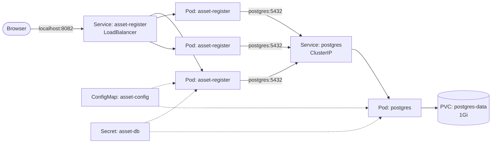

# Lab 04 – Asset Register and PostgreSQL on Kubernetes

In this lab I moved my Asset Register app and its PostgreSQL database from Docker Compose onto Kubernetes. It is the same app I built in my [docker-asset-register](https://github.com/iM-MQ/docker-asset-register) project, pulled from GitHub Container Registry using the image my CI pipeline published.

The aim was to rebuild each part of the Compose setup using the proper Kubernetes object, then test that the data survives, the app waits for the database, and a bad release never reaches users.


## What this lab demonstrates

- Storing the database password in a **Secret**, created with kubectl so it never touches the repo
- Keeping non-secret settings in a **ConfigMap** shared by the app and the database
- Persisting database data with a **PersistentVolumeClaim**
- An **init container** that waits for PostgreSQL before the app starts
- **Readiness and liveness probes** on both the app and the database
- An internal **ClusterIP** Service for the database and an external **LoadBalancer** Service for the app
- Debugging a stuck rollout caused by a broken readiness probe

## Architecture



## How Compose maps to Kubernetes

| In Compose | In Kubernetes |
|---|---|
| `DB_HOST`, `DB_NAME`, `DB_USER` | ConfigMap `asset-config` |
| `POSTGRES_PASSWORD` / `DB_PASSWORD` | Secret `asset-db` |
| `dbdata` named volume | PersistentVolumeClaim `postgres-data` |
| `depends_on: service_healthy` | Init container `wait-for-postgres` |
| `pg_isready` healthcheck | Readiness and liveness probes on Postgres |
| Dockerfile `HEALTHCHECK` on `/health` | Readiness and liveness probes on the app |
| `backend` network with `internal: true` | ClusterIP Service (not reachable from outside the cluster) |
| `127.0.0.1:8080:5000` | LoadBalancer Service on `localhost:8082` |
| `mem_limit` | Resource requests and limits |

## Files

| File | What it creates |
|---|---|
| `configmap.yaml` | ConfigMap with the database host, name and user |
| `pvc.yaml` | 1Gi PersistentVolumeClaim for the database |
| `postgres.yaml` | PostgreSQL Deployment and ClusterIP Service |
| `app.yaml` | Asset Register Deployment (with init container) and LoadBalancer Service |

The Secret is not in the repo. It is created with a command (step 2).

## Prerequisites

- Docker Desktop with Kubernetes enabled (I used the Kubeadm option, v1.36.1)
- kubectl pointing at the `docker-desktop` context
- The Asset Register image published to GHCR (mine is public, so no pull secret is needed)

## How I built it

### Step 1 – Checked the cluster

```powershell
kubectl config current-context
```

```powershell
kubectl get nodes
```

**What I saw:**

```
docker-desktop

NAME             STATUS   ROLES           AGE   VERSION
docker-desktop   Ready    control-plane   43h   v1.36.1
```

### Step 2 – Created the Secret

I created the Secret directly with kubectl so the password is never written to a file in the repo.

```powershell
kubectl create secret generic asset-db --from-literal=password=<your-local-password>
```

```powershell
kubectl describe secret asset-db
```

**What I saw:** `describe` only shows the size of the value, not the value itself.

```
Type:  Opaque

Data
====
password:  11 bytes
```

I then decoded it to prove a point:

```powershell
[Text.Encoding]::UTF8.GetString([Convert]::FromBase64String((kubectl get secret asset-db -o jsonpath="{.data.password}")))
```

It printed the password in plain text. A Secret is only **base64-encoded, not encrypted**, so anyone who can read Secrets in the namespace can read the password. For AKS I'll look at Azure Key Vault instead.

### Step 3 – Created the ConfigMap

```powershell
kubectl apply -f lab-04-asset-register\configmap.yaml
```

```powershell
kubectl describe configmap asset-config
```

**What I saw:**

```
DB_HOST:
----
postgres

DB_NAME:
----
assets

DB_USER:
----
assetapp
```

`DB_HOST` is set to `postgres`, which is the name of the database Service. CoreDNS resolves it to the Service IP.

### Step 4 – Created the PersistentVolumeClaim

```powershell
kubectl apply -f lab-04-asset-register\pvc.yaml
```

```powershell
kubectl get pvc postgres-data
```

```powershell
kubectl get pv
```

**What I saw:**

```
NAME            STATUS   VOLUME                                     CAPACITY   ACCESS MODES   STORAGECLASS
postgres-data   Bound    pvc-4630fa3e-d305-4e5a-8a4f-7eb37613efd8   1Gi        RWO            hostpath

NAME                                       CAPACITY   ACCESS MODES   RECLAIM POLICY   STATUS   CLAIM
pvc-4630fa3e-d305-4e5a-8a4f-7eb37613efd8   1Gi        RWO            Delete           Bound    default/postgres-data
```

Docker Desktop's default `hostpath` StorageClass created the volume straight away. The reclaim policy is `Delete`, which means deleting the claim also deletes the data.

### Step 5 – Deployed PostgreSQL

```powershell
kubectl apply -f lab-04-asset-register\postgres.yaml
```

```powershell
kubectl get pods -l app=postgres -w
```

```powershell
kubectl logs deployment/postgres --tail=5
```

```powershell
kubectl get endpointslices -l kubernetes.io/service-name=postgres
```

**What I saw:**

```
postgres-6d5c985b76-bq74k   1/1     Running   0          18s

LOG:  database system is ready to accept connections

NAME             ADDRESSTYPE   PORTS   ENDPOINTS   AGE
postgres-5t9dj   IPv4          5432    10.1.0.40   79s
```

A few choices in `postgres.yaml`:

- `strategy: Recreate` – a normal rolling update starts the new Pod before stopping the old one. Two Postgres instances writing to the same data files would corrupt them, so Recreate stops the old Pod first.
- `PGDATA` set to a subfolder of the mount – cloud disks such as Azure Disk come with a `lost+found` folder and Postgres won't initialise into a folder that isn't empty. Using a subfolder now means the same manifest will work on AKS.
- Readiness and liveness probes both run `pg_isready`, the same check I used in Compose.

### Step 6 – Deployed the Asset Register

```powershell
kubectl apply -f lab-04-asset-register\app.yaml
```

```powershell
kubectl get pods -l app=asset-register -w
```

```powershell
kubectl logs deployment/asset-register -c wait-for-postgres
```

```powershell
kubectl get svc asset-register
```

**What I saw:**

```
asset-register-7c7df87c58-q8qdh   0/1     Running   0          11s
asset-register-7c7df87c58-q8qdh   1/1     Running   0          15s

postgres:5432 - accepting connections

NAME             TYPE           CLUSTER-IP     EXTERNAL-IP   PORT(S)
asset-register   LoadBalancer   10.109.71.72   localhost     8082:30152/TCP
```

I opened `http://localhost:8082`, added two assets and they saved.

The image is pinned to the commit SHA my pipeline tagged, not `latest`, so the cluster always runs the exact build CI produced.

## Testing it

### Test 1 – Data survives a database restart

I deleted the Postgres Pod to check the data was on the volume and not inside the Pod.

```powershell
kubectl delete pod -l app=postgres
```

```powershell
kubectl get pods -l app=postgres -w
```

```powershell
kubectl describe pod -l app=postgres | Select-String "ClaimName"
```

**What I saw:**

```
pod "postgres-6d5c985b76-bq74k" deleted

postgres-6d5c985b76-mfvq8   1/1     Running   0          8s

    ClaimName:  postgres-data
```

A new Pod (`mfvq8`) replaced the old one and mounted the same claim. Both assets were still there, and I added a third to prove writes worked against the new Pod. The app recovered without errors, which tells me it opens a fresh database connection per request.

### Test 2 – The app waits for the database

The app runs `init_db()` once at start-up. If Postgres isn't ready, it would crash. Compose solved this with `depends_on`; Kubernetes doesn't have that, so I used an init container.

To test it, I stopped Postgres and forced a new app Pod to start.

```powershell
kubectl scale deployment postgres --replicas=0
```

```powershell
kubectl delete pod -l app=asset-register
```

```powershell
kubectl get pods -l app=asset-register
```

```powershell
kubectl logs deployment/asset-register -c wait-for-postgres --tail=4
```

**What I saw:**

```
asset-register-7c7df87c58-fzlsz   0/1     Init:0/1   0          44s

postgres:5432 - no response
waiting for postgres
postgres:5432 - no response
waiting for postgres
```

Then I brought Postgres back:

```powershell
kubectl scale deployment postgres --replicas=1
```

```powershell
kubectl get pods -l app=asset-register -w
```

```
asset-register-7c7df87c58-fzlsz   0/1     Running   0          72s
asset-register-7c7df87c58-fzlsz   1/1     Running   0          75s
```

The app started by itself with **0 restarts**. Without the init container this would have been a `CrashLoopBackOff`.

### Test 3 – Scaling and load balancing

```powershell
kubectl scale deployment asset-register --replicas=3
```

```powershell
kubectl get endpointslices -l kubernetes.io/service-name=asset-register
```

```powershell
1..6 | ForEach-Object { (curl.exe -s http://localhost:8082 | Select-String "Served by").Line.Trim() }
```

**What I saw:**

```
NAME                   ADDRESSTYPE   PORTS   ENDPOINTS
asset-register-2nmfr   IPv4          5000    10.1.0.43,10.1.0.45,10.1.0.46

Served by container asset-register-7c7df87c58-fzlsz | 3 assets
Served by container asset-register-7c7df87c58-mvzqq | 3 assets
Served by container asset-register-7c7df87c58-mppvv | 3 assets
Served by container asset-register-7c7df87c58-mvzqq | 3 assets
Served by container asset-register-7c7df87c58-fzlsz | 3 assets
Served by container asset-register-7c7df87c58-fzlsz | 3 assets
```

Three Pods shared the traffic and all of them showed the same 3 assets, because they share one database. I used `curl.exe` rather than a browser, because a browser keeps its connection open and sticks to one Pod.

## Issues I hit

### 1. A broken readiness probe stalled the rollout

I deliberately changed the readiness probe path from `/health` to `/healthz` (which doesn't exist) and applied it, to see what Kubernetes does with a bad release. At the same time I changed `replicas: 1` to `replicas: 3` in the file, because I had scaled with a command and the file needed to match the cluster.

**Symptom:** the rollout never finished.

```powershell
kubectl rollout status deployment/asset-register
```

```
Waiting for deployment "asset-register" rollout to finish: 1 out of 3 new replicas have been updated...
```

```powershell
kubectl get pods -l app=asset-register
```

```
asset-register-7c7df87c58-fzlsz   1/1     Running   0          42m
asset-register-7c7df87c58-mppvv   1/1     Running   0          40m
asset-register-7c7df87c58-mvzqq   1/1     Running   0          40m
asset-register-f7567474b-mmz79    0/1     Running   0          9m27s
```

**Investigation:**

```powershell
kubectl describe pod asset-register-f7567474b-mmz79 | Select-String "Readiness"
```

```
Readiness:  http-get http://:5000/healthz delay=5s timeout=1s period=5s #success=1 #failure=3
Warning  Unhealthy  5m (x64 over 10m)  kubelet  Readiness probe failed: HTTP probe failed with statuscode: 404
```

The app returned 404 because the route is `/health`, not `/healthz`.

**What this showed me:**

- The new Pod never received traffic. The three old Pods kept serving users the whole time.
- The broken Pod had **0 restarts**. Only the readiness probe was wrong; the liveness probe still used `/health`, so Kubernetes knew the container was alive and left it alone.

| Probe | What happens when it fails |
|---|---|
| Readiness | Pod is removed from the Service – no traffic, no restart |
| Liveness | Container is restarted |

**Fix:** I corrected the path in `app.yaml` and applied it again, rather than using `kubectl rollout undo`. Undo fixes the cluster but leaves the mistake in the file, so the next `apply` would bring it back (I learned that in Lab 02).

```powershell
kubectl apply -f lab-04-asset-register\app.yaml
```

```powershell
kubectl rollout status deployment/asset-register
```

```
deployment "asset-register" successfully rolled out

asset-register-7c7df87c58-fzlsz   1/1     Running       0          44m
asset-register-7c7df87c58-mppvv   1/1     Running       0          42m
asset-register-7c7df87c58-mvzqq   1/1     Running       0          42m
asset-register-f7567474b-mmz79    0/1     Terminating   0          11m
```

I expected three new Pods, but Kubernetes kept the original three. Once the path was fixed, the Pod template matched the original ReplicaSet (`7c7df87c58`) exactly, so Kubernetes scaled the broken ReplicaSet down to zero and reused the healthy one. Nothing restarted and users saw no change.

### 2. PowerShell rejected a placeholder

```
The '<' operator is reserved for future use.
```

I had pasted a command with `<name-of-the-pod>` still in it. PowerShell treats `<` as a special character. I replaced it with the real Pod name and it worked.

## Security practices

- The database password is in a Secret created with kubectl, not in any file in the repo
- I scanned the manifests for the word "password" before committing; the only matches were variable and key names
- The database is only reachable inside the cluster (ClusterIP)
- The app image runs as a non-root user (set in the Dockerfile)
- The image is pinned to a commit SHA, not `latest`
- Every container has CPU and memory requests and limits

## Cleaning up

```powershell
kubectl delete -f lab-04-asset-register
```

```powershell
kubectl delete secret asset-db
```

Deleting `pvc.yaml` removes the claim, and because the reclaim policy is `Delete`, the data goes with it.

## What I learned

- Kubernetes has no `depends_on`. An init container is a clean way to make an app wait for its dependencies.
- A Secret is base64-encoded, not encrypted. It keeps the password out of the repo, but it is not a vault.
- A readiness probe protects users from a broken release; a liveness probe restarts a hung container. They do different jobs.
- Postgres should use `Recreate`, not a rolling update, so two instances never write to the same data.
- Kubernetes identifies a version by its Pod template. Going back to a known-good template reuses the existing ReplicaSet.
- If I change something with a command, I update the file too, or the next `apply` undoes it.

## References

Official documentation I used while building, testing and debugging this lab.

| What I did | Documentation |
|---|---|
| Created the Secret with kubectl and decoded it | [Managing Secrets using kubectl](https://kubernetes.io/docs/tasks/configmap-secret/managing-secret-using-kubectl/) |
| Stored non-secret settings in a ConfigMap and loaded them as environment variables | [ConfigMaps](https://kubernetes.io/docs/concepts/configuration/configmap/) |
| Requested storage with a PersistentVolumeClaim and checked the reclaim policy | [Persistent Volumes](https://kubernetes.io/docs/concepts/storage/persistent-volumes/) |
| Set the Postgres environment variables and `PGDATA` | [postgres – Docker Official Image](https://hub.docker.com/_/postgres) |
| Used the `Recreate` strategy for Postgres | [Deployments](https://kubernetes.io/docs/concepts/workloads/controllers/deployment/) |
| Made the app wait for Postgres with an init container | [Init Containers](https://kubernetes.io/docs/concepts/workloads/pods/init-containers/) |
| Added readiness and liveness probes (exec and httpGet) | [Configure Liveness, Readiness and Startup Probes](https://kubernetes.io/docs/tasks/configure-pod-container/configure-liveness-readiness-probes/) |
| Exposed Postgres internally and the app externally | [Service](https://kubernetes.io/docs/concepts/services-networking/service/) |
| Checked the Pod IPs behind each Service | [EndpointSlices](https://kubernetes.io/docs/concepts/services-networking/endpoint-slices/) |
| Scaled the app to three replicas | [Horizontal Manual Scaling for a Deployment](https://kubernetes.io/docs/tasks/run-application/scale-deployment/) |
| Debugged the stuck rollout | [Update a Deployment Without Downtime](https://kubernetes.io/docs/tasks/run-application/update-deployment-rolling/) |