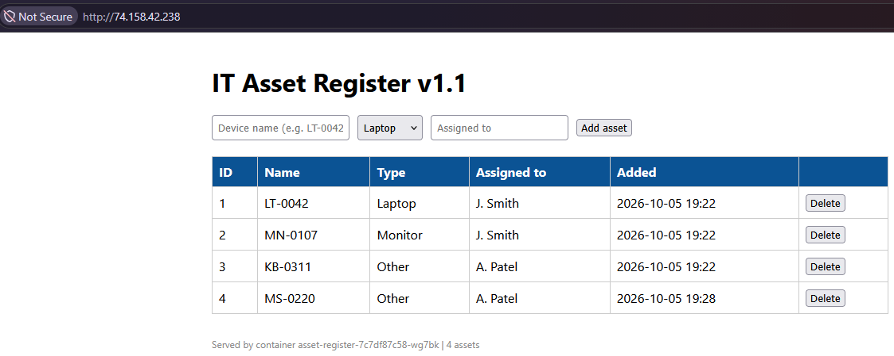

# Lab 05: The Asset Register on AKS, Built with Terraform

## Overview

| | |
|---|---|
| **Goal** | Build an Azure Kubernetes Service (AKS) cluster with Terraform, deploy the Lab 04 Asset Register to it, test it on real Azure infrastructure, then tear it all down cleanly |
| **Runs on** | AKS in Azure (Sweden Central), with Terraform state in Azure Storage |
| **Cost** | Small: one 2-vCPU node for about an hour, destroyed straight after testing |
| **Time** | About 3 hours, including a real troubleshooting session |

This is the capstone of the Kubernetes labs. Everything so far ran on Docker Desktop on my laptop. Here I built a managed cluster in Azure with the same Terraform approach as my [Terraform labs](https://github.com/iM-MQ/terraform-azure-labs), and deployed the same manifests from Lab 04 with a one-line change.

The most useful part turned out to be the first apply failing. Working out why took me from a misleading error message to the real root cause, a restriction on my free trial subscription, and gave me a pre-flight checklist I would now run before any AKS build.

```
 Terraform ──► Resource group "rg-k8slab05"
                    └── AKS cluster "aks-k8slab05"  (control plane run by Microsoft)
                              │
                              ▼
               Resource group "MC_rg-k8slab05_..."  (created and managed by AKS)
                    ├── VM scale set  ──► 1 node, Standard_D2s_v5
                    ├── Load balancer ──► public IP for the Asset Register
                    ├── Network security group
                    └── Azure Disk    ──► PostgreSQL data (created by the PVC)

 Terraform state ──► Azure Storage "rg-tfstate-uks"
```

### From Docker Desktop to AKS

| | Docker Desktop (Lab 04) | AKS (this lab) |
|---|---|---|
| **Cluster built by** | A tick box in Docker Desktop | Terraform |
| **Control plane** | Pods I could see (`etcd`, `kube-apiserver`) | Run by Microsoft, not visible in the cluster |
| **Storage behind the PVC** | A folder on my laptop (`hostpath`) | A real Azure managed disk |
| **LoadBalancer Service** | `localhost:8082` | A public IP address on the internet |
| **`kubectl top`** | Not available | Works, because AKS includes metrics-server |
| **Manifest changes** | | **One line:** the Service port, from `8082` to `80` |

---

## Following along?

- I ran every command in **PowerShell** on Windows, using the terminal inside **VS Code**.
- Each command is in its own box. Run **one line at a time**.
- Boxes marked **What I saw** show my output. They are not commands to run.
- Resource names with random endings, IP addresses and pod names will differ on your machine.
- I have removed my subscription ID from every output. Azure CLI and Terraform print it in resource IDs, so check your own output before sharing it.
- If you use a **free trial** subscription, read [Issue 1](#1-the-vm-size-was-not-allowed) first. It explains why this lab runs in Sweden Central.

See the [main README prerequisites](../README.md#prerequisites), and [Terraform Lab 04](https://github.com/iM-MQ/terraform-azure-labs/tree/main/lab-04-remote-state) for the state storage this lab uses.

---

## The Terraform

All five files are in the `terraform` folder.

### `providers.tf`

```hcl
terraform {
  required_version = ">= 1.9"

  required_providers {
    azurerm = {
      source  = "hashicorp/azurerm"
      version = "~> 4.0"
    }
  }
}

provider "azurerm" {
  features {}
}
```

### `backend.tf`

```hcl
terraform {
  backend "azurerm" {
    resource_group_name  = "rg-tfstate-uks"
    storage_account_name = "sttfstateb4jrjb"
    container_name       = "tfstate"
    key                  = "k8s-lab05-aks.tfstate"
  }
}
```

The storage account name has a random ending from my bootstrap code. Use the name from your own bootstrap output.

### `variables.tf`

```hcl
variable "location" {
  description = "Azure region for the cluster. Sweden Central, because the free trial has no general-purpose VM sizes in either UK region"
  type        = string
  default     = "swedencentral"
}

variable "prefix" {
  description = "Short name used to build resource names"
  type        = string
  default     = "k8slab05"

  validation {
    condition     = can(regex("^[a-z0-9]{3,12}$", var.prefix))
    error_message = "The prefix must be 3 to 12 lowercase letters or numbers."
  }
}

variable "kubernetes_version" {
  description = "Kubernetes version, checked with az aks get-versions"
  type        = string
  default     = "1.36.4"
}

variable "node_count" {
  description = "Number of nodes in the system node pool"
  type        = number
  default     = 1

  validation {
    condition     = var.node_count == 1
    error_message = "This subscription has 4 vCPUs. One 2-vCPU node plus one surge node during upgrades uses all 4, so the node count must be 1."
  }
}

variable "node_size" {
  description = "VM size for the nodes"
  type        = string
  default     = "Standard_D2s_v5"
}

variable "tags" {
  description = "Tags applied to every resource"
  type        = map(string)
  default = {
    project    = "kubernetes-labs"
    lab        = "05"
    managed_by = "terraform"
  }
}
```

### `main.tf`

```hcl
# Resource group for the cluster
resource "azurerm_resource_group" "aks" {
  name     = "rg-${var.prefix}"
  location = var.location
  tags     = var.tags
}

# The AKS cluster
resource "azurerm_kubernetes_cluster" "aks" {
  name                = "aks-${var.prefix}"
  location            = azurerm_resource_group.aks.location
  resource_group_name = azurerm_resource_group.aks.name
  dns_prefix          = var.prefix
  kubernetes_version  = var.kubernetes_version
  sku_tier            = "Free"

  default_node_pool {
    name                 = "system"
    node_count           = var.node_count
    vm_size              = var.node_size
    orchestrator_version = var.kubernetes_version

    upgrade_settings {
      max_surge = "10%"
    }
  }

  identity {
    type = "SystemAssigned"
  }

  network_profile {
    network_plugin      = "azure"
    network_plugin_mode = "overlay"
    load_balancer_sku   = "standard"
  }

  tags = var.tags
}
```

### `outputs.tf`

```hcl
output "resource_group_name" {
  value = azurerm_resource_group.aks.name
}

output "cluster_name" {
  value = azurerm_kubernetes_cluster.aks.name
}

output "kubernetes_version" {
  value = azurerm_kubernetes_cluster.aks.current_kubernetes_version
}

output "node_resource_group" {
  value = azurerm_kubernetes_cluster.aks.node_resource_group
}

output "get_credentials_command" {
  value = "az aks get-credentials --resource-group ${azurerm_resource_group.aks.name} --name ${azurerm_kubernetes_cluster.aks.name}"
}
```

| Setting | Why |
|---|---|
| `kubernetes_version` and `orchestrator_version` pinned | The control plane and node run the exact version I checked was available, not whatever Azure defaults to on the day |
| `sku_tier = "Free"` | Microsoft runs the control plane at no charge. The paid tier adds an uptime SLA, which matters in production but not in a lab |
| `name = "system"` node pool | AKS needs a system pool for its own components such as CoreDNS. In a lab, my app shares it |
| `upgrade_settings { max_surge = "10%" }` | Azure's default written down, so Terraform does not report a difference after every apply |
| `identity { type = "SystemAssigned" }` | The cluster gets its own managed identity to create load balancers and disks, so there is no password to manage |
| `network_plugin = "azure"` with `overlay` | Microsoft's recommended networking. Pods get addresses from a private overlay range instead of using up addresses in a VNet |
| `node_count` validation | My 4-vCPU quota fits one 2-vCPU node plus one surge node during an upgrade. Terraform stops a second node before Azure does |
| The reason in the `location` description | Records **why** the region was chosen, so nobody "fixes" it back to UK South later |

## The manifests

The `manifests` folder holds the four files from [Lab 04](../lab-04-asset-register), copied across. I compared them with `git diff --no-index`:

```powershell
git diff --no-index lab-04-asset-register\app.yaml lab-05-aks\manifests\app.yaml
```

**What I saw:**

```
@@ -69,5 +69,5 @@ spec:
   selector:
     app: asset-register
   ports:
-    - port: 8082
+    - port: 80
       targetPort: 5000
```

```powershell
git diff --no-index lab-04-asset-register\postgres.yaml lab-05-aks\manifests\postgres.yaml
```

No output at all: the database manifest is identical. The only change in the whole app is the Service port. On AKS each LoadBalancer Service gets its own public IP, so there is no port clash to avoid and 80 is the normal web port.

Two choices I made in Lab 04 paid off here:

- **The PVC names no storage class**, so on AKS it automatically used the default Azure Disk class.
- **`PGDATA` points to a subfolder** of the volume. Azure Disks come with a `lost+found` folder and Postgres will not set up in a folder that is not empty, so the manifest worked on Azure unchanged.

---

## How I did it

### Step 1: Checked the tools and the resource provider

In Terraform Lab 05 my first apply failed because the `Microsoft.App` provider was not registered, so this time I checked the AKS provider before writing any code:

```powershell
az provider show --namespace Microsoft.ContainerService --query registrationState -o tsv
```

**What I saw:**

```
Registered
```

### Step 2: Rebuilt the state storage

I reused the bootstrap code from [Terraform Lab 04](https://github.com/iM-MQ/terraform-azure-labs/tree/main/lab-04-remote-state) to create the storage account for Terraform state.

```powershell
cd C:\terraform-labs\lab-04-remote-state\bootstrap
```

```powershell
terraform plan -out=tfplan
```

```powershell
terraform apply tfplan
```

**What I saw:**

```
Apply complete! Resources: 4 added, 0 changed, 0 destroyed.

Outputs:

container_name = "tfstate"
resource_group_name = "rg-tfstate-uks"
storage_account_name = "sttfstateb4jrjb"
```

### Step 3: Checked what Azure would allow

Before writing the cluster code I checked the Kubernetes versions and my vCPU quota:

```powershell
az aks get-versions --location uksouth --output table
```

The newest version not marked as a preview was **1.36.4**, so I pinned the cluster to it. `1.37.0` was listed as `IsPreview: True`.

```powershell
az vm list-usage --location uksouth --query "[?name.value=='standardDSv5Family' || name.value=='cores'].{Name:localName, Used:currentValue, Limit:limit}" --output table
```

**What I saw:**

```
Name                        Used    Limit
--------------------------  ------  -------
Total Regional vCPUs        0       4
Standard DSv5 Family vCPUs  0       4
```

This looked fine, but it turned out to be only half of the check. See [Issue 1](#1-the-vm-size-was-not-allowed).

### Step 4: Wrote the Terraform and initialised it

```powershell
cd C:\kubernetes-labs\lab-05-aks\terraform
```

```powershell
terraform init
```

```powershell
terraform fmt
```

```powershell
terraform validate
```

**What I saw:**

```
- Installed hashicorp/azurerm v4.81.0 (signed by HashiCorp)

Terraform has been successfully initialized!

Success! The configuration is valid.
```

Terraform created `.terraform.lock.hcl`, which I committed so anyone cloning the repo gets the same provider version.

### Step 5: Built the cluster

My first apply in UK South failed. After the investigation in [Issue 1](#1-the-vm-size-was-not-allowed), I changed the region to Sweden Central and planned again:

```powershell
terraform plan -out=tfplan
```

**What I saw:**

```
  # azurerm_resource_group.aks must be replaced
-/+ resource "azurerm_resource_group" "aks" {
      ~ location   = "uksouth" -> "swedencentral" # forces replacement
        name       = "rg-k8slab05"
    }

Plan: 2 to add, 0 to change, 1 to destroy.
```

The failed apply had already created the resource group in UK South. A resource group's region cannot be changed, so Terraform planned to delete it and create it again. Here it was empty, so that was safe. In production, `forces replacement` on a resource group would delete everything inside it, which is why it is the first thing I look for in a plan.

```powershell
terraform apply tfplan
```

**What I saw:**

```
azurerm_resource_group.aks: Destruction complete after 21s
azurerm_resource_group.aks: Creation complete after 25s
azurerm_kubernetes_cluster.aks: Creation complete after 4m45s

Apply complete! Resources: 2 added, 0 changed, 1 destroyed.

Outputs:

cluster_name = "aks-k8slab05"
get_credentials_command = "az aks get-credentials --resource-group rg-k8slab05 --name aks-k8slab05"
kubernetes_version = "1.36.4"
node_resource_group = "MC_rg-k8slab05_aks-k8slab05_swedencentral"
resource_group_name = "rg-k8slab05"
```

The `node_resource_group` is a second resource group that AKS creates and manages by itself. It holds the node VMs, disks, load balancer and public IPs, and it is deleted with the cluster.

### Step 6: Connected kubectl and looked around

```powershell
az aks get-credentials --resource-group rg-k8slab05 --name aks-k8slab05
```

```powershell
kubectl config get-contexts
```

**What I saw:**

```
CURRENT   NAME             CLUSTER          AUTHINFO
*         aks-k8slab05     aks-k8slab05     clusterUser_rg-k8slab05_aks-k8slab05
          docker-desktop   docker-desktop   docker-desktop
```

From here on, kubectl was pointing at Azure. I ran `kubectl config current-context` before every `apply` and `delete`.

```powershell
kubectl get nodes -o wide
```

```
NAME                             STATUS   ROLES    VERSION   INTERNAL-IP   EXTERNAL-IP   OS-IMAGE
aks-system-24671037-vmss000000   Ready    <none>   v1.36.4   10.224.0.4    <none>        Ubuntu 24.04.5 LTS
```

The node has no external IP, so it cannot be reached from the internet directly.

```powershell
kubectl get pods -n kube-system
```

```
NAME                                  READY   STATUS
azure-cns-bmvdl                       2/2     Running
cloud-node-manager-pdk8d              1/1     Running
coredns-5c949dd7f8-6q6cn              1/1     Running
csi-azuredisk-node-xv8zf              3/3     Running
konnectivity-agent-6846594d89-4hh7h   1/1     Running
kube-proxy-wvjpx                      1/1     Running
metrics-server-5dd6f8c659-cp2z2       2/2     Running
```

(Shortened.) Compared with Lab 01 on Docker Desktop, there is no `etcd`, `kube-apiserver` or `kube-scheduler`. Microsoft runs the control plane outside my subscription, which is what "managed Kubernetes" means. `konnectivity-agent` is the tunnel from the node back to it, and `csi-azuredisk-node` is the driver that creates Azure Disks.

```powershell
kubectl get storageclass
```

```
NAME                     PROVISIONER          RECLAIMPOLICY   VOLUMEBINDINGMODE
default (default)        disk.csi.azure.com   Delete          WaitForFirstConsumer
managed-csi              disk.csi.azure.com   Delete          WaitForFirstConsumer
managed-csi-premium      disk.csi.azure.com   Delete          WaitForFirstConsumer
azurefile-csi            file.csi.azure.com   Delete          Immediate
```

(Shortened.) The default class is an Azure Disk, so my PVC needed no change.

### Step 7: Deployed the Asset Register

```powershell
kubectl config current-context
```

```powershell
kubectl create secret generic asset-db --from-literal=password=<your-password>
```

```powershell
kubectl apply -f lab-05-aks\manifests
```

```powershell
kubectl get pvc
```

```powershell
kubectl get pods
```

```powershell
kubectl get svc asset-register -w
```

**What I saw:**

```
postgres-data   Bound    pvc-adf34de8-8ada-46f7-abd9-e6af9d901480   1Gi   RWO   default

asset-register-7c7df87c58-mh274   1/1     Running   0
asset-register-7c7df87c58-ntssl   1/1     Running   0
asset-register-7c7df87c58-wg7bk   1/1     Running   0
postgres-6d5c985b76-v9glv         1/1     Running   0

NAME             TYPE           CLUSTER-IP     EXTERNAL-IP     PORT(S)
asset-register   LoadBalancer   10.0.226.213   74.158.42.238   80:31902/TCP
```

All pods started with no restarts. The init container from Lab 04 kept the app waiting while Azure created and attached the database disk. The ReplicaSet hash, `7c7df87c58`, is the same as in Lab 04, because the pod template is identical. The Service port is not part of it.

I opened the public IP in my browser and added three assets.



The browser shows **Not Secure** because the site is plain HTTP. In production I would put an ingress controller with a TLS certificate in front of it.

---

## Tests I carried out

### Test 1: The PVC is a real Azure Disk

```powershell
kubectl get pv
```

```powershell
az disk list --resource-group MC_rg-k8slab05_aks-k8slab05_swedencentral --query "[].{Name:name, SizeGB:diskSizeGB, State:diskState, Sku:sku.name}" --output table
```

**What I saw:**

```
NAME                                       CAPACITY   RECLAIM POLICY   STATUS   CLAIM
pvc-adf34de8-8ada-46f7-abd9-e6af9d901480   1Gi        Delete           Bound    default/postgres-data

Name                                      SizeGB    State     Sku
----------------------------------------  --------  --------  ---------------
pvc-adf34de8-8ada-46f7-abd9-e6af9d901480  1         Attached  StandardSSD_LRS
```

The Kubernetes volume and the Azure Disk have the same name: they are the same object. The disk is `StandardSSD_LRS`, which keeps three copies within one data centre. For production I would consider zone-redundant storage, or a managed database like the Azure PostgreSQL in my Terraform Lab 05.

The node's own OS disk did not appear in the list. It belongs to the VM scale set rather than being a standalone disk, which is exactly why the database disk, being standalone, can be moved between nodes.

### Test 2: The data survives the database pod being replaced

```powershell
kubectl delete pod -l app=postgres
```

```powershell
kubectl get pods -l app=postgres -w
```

```powershell
kubectl describe pod -l app=postgres | Select-String "Scheduled|Attach|Pulled|Started"
```

**What I saw:**

```
postgres-6d5c985b76-pqr77   1/1     Running   0          10s

Normal  Scheduled  default-scheduler  Successfully assigned default/postgres-6d5c985b76-pqr77 to aks-system-24671037-vmss000000
Normal  Pulled     kubelet            Container image "postgres:16-alpine" already present on machine
Normal  Started    kubelet            Container started
```

The replacement was running in 10 seconds and all three assets were still there.

There was no `Attach` event. With only one node, the new pod went back onto the same node, where the disk was still attached. On a multi-node cluster the pod could move to another node, and Azure would have to detach the disk and attach it there, which adds time. My 4-vCPU trial quota could not run a second node, so this test did not cover that case.

### Test 3: What pods ask for compared with what they use

AKS includes metrics-server, so `kubectl top` works here, unlike on Docker Desktop.

```powershell
kubectl top node
```

```powershell
kubectl top pods
```

```powershell
kubectl describe node | Select-String -Pattern "Allocated resources" -Context 0,8
```

**What I saw:**

```
NAME                             CPU(cores)   CPU(%)   MEMORY(bytes)   MEMORY(%)
aks-system-24671037-vmss000000   120m         6%       1394Mi          24%

NAME                              CPU(cores)   MEMORY(bytes)
asset-register-7c7df87c58-mh274   1m           30Mi
asset-register-7c7df87c58-ntssl   1m           30Mi
asset-register-7c7df87c58-wg7bk   1m           30Mi
postgres-6d5c985b76-pqr77         5m           19Mi

  Resource           Requests      Limits
  --------           --------      ------
  cpu                1177m (61%)   10892m (573%)
  memory             1314Mi (22%)  13410592Ki (226%)
```

| | CPU |
|---|---|
| Actually used | 120m (6%) |
| Requested, so treated as taken by the scheduler | 1177m (61%) |

- **The scheduler plans by requests, not real use.** The node was 6% busy, but 61% of its CPU was promised.
- **Most of the requests were AKS's own.** My four pods request 250m. The rest belongs to system pods such as CoreDNS, the network plugin and the disk driver. On a small node, the platform is the biggest consumer.
- **My app pods are generously sized.** Each requests 50m CPU and uses 1m. `kubectl top` over a period is how I would right-size them in production.
- **Limits add up to 573%.** Limits only cap individual pods and the scheduler ignores them, so overcommitting them is normal. Requests are what guarantee each pod's share.

### Test 4: Locking the public IP down to my own address

The app was open to the whole internet. I restricted it to my home IP with `loadBalancerSourceRanges`, without putting my IP into Git.

I widened the `.gitignore` rule to cover any `.local.yaml` file, then wrote a small patch file containing my IP:

```powershell
$myip = Invoke-RestMethod https://api.ipify.org
```

```powershell
"spec:`n  loadBalancerSourceRanges:`n    - $myip/32" | Set-Content C:\kubernetes-labs\lab-05-aks\allow-my-ip.local.yaml
```

```powershell
git -C C:\kubernetes-labs check-ignore -v lab-05-aks/allow-my-ip.local.yaml
```

**What I saw:**

```
.gitignore:2:*.local.yaml       lab-05-aks/allow-my-ip.local.yaml
```

The file is ignored by Git. It sits outside the `manifests` folder so `kubectl apply -f lab-05-aks\manifests` never picks it up. This is the same pattern as the Secret: the committed manifests stay generic, and the environment-specific value is applied separately.

Before applying it, I checked the app loaded on my phone using mobile data, which has a different public IP from my home. Then:

```powershell
kubectl patch service asset-register --patch-file C:\kubernetes-labs\lab-05-aks\allow-my-ip.local.yaml
```

```
service/asset-register patched
```

AKS turned this into a network security group rule by itself. I listed it with my IP replaced:

```
name     : k8s-azure-lb_allow_IPv4_92e32eb871d227fe67cd8bfdbf0d2b05
priority : 501
access   : Allow
Ports    : 80
Sources  : <my IP>
```

| Test | Result |
|---|---|
| Phone on mobile data, before | Loaded |
| Phone on mobile data, after | Did not load |
| Laptop at home, after | Loaded |

One Service setting closed the app to everyone except me, and AKS created the Azure firewall rule for it.

---

## Issues I hit and how I fixed them

### 1. The VM size was not allowed

**Symptom.** The resource group was created, then the cluster failed:

```
Error: creating Kubernetes Cluster (Resource Group Name: "rg-k8slab05", Kubernetes Cluster Name: "aks-k8slab05"):
unexpected status 400 (400 Bad Request) with response: {
  "code": "BadRequest",
  "message": "The VM size of Standard_D2s_v5 is not allowed in your subscription in location 'uksouth'."
}
```

**Investigation.** My quota showed 4 DSv5 vCPUs available, so quota was not the problem. I listed the VM sizes Azure would offer me:

```powershell
(az vm list-skus --location uksouth --resource-type virtualMachines --output json | ConvertFrom-Json).Count
```

```
0
```

Zero sizes in UK South. To rule out the command itself, I tried other regions:

| Region | VM sizes returned |
|---|---|
| UK South | 0 |
| UK West | 103, but only specialist sizes (`FX`, `M`, `NV`, `ND`), no D-series or B-series |
| North Europe | 140 |

`az vm list-skus` hides sizes that are not available to the subscription unless `--all` is added, which is why `Standard_D2s_v5` did not appear at all rather than appearing with a restriction. I then checked what type of subscription I had:

```powershell
$sub = az account show --query id -o tsv
```

```powershell
az rest --method get --url "https://management.azure.com/subscriptions/${sub}?api-version=2022-12-01" --query subscriptionPolicies
```

```
{
  "locationPlacementId": "Public_2014-09-01",
  "quotaId": "FreeTrial_2014-09-01",
  "spendingLimit": "On"
}
```

**Root cause.** A **free trial** subscription. Microsoft restricts which VM sizes free trials can use, region by region, and everyday sizes in busy regions such as both UK regions were withheld. My earlier labs had worked because resource groups, VNets, storage, Azure PostgreSQL and Container Apps do not need me to deploy raw VMs. AKS was the first lab that did.

**Fix.** I scanned four other regions for an unrestricted size with 2 vCPUs and at least 4 GB of RAM:

```powershell
foreach ($r in 'northeurope','westeurope','swedencentral','francecentral') { $s = az vm list-skus --location $r --resource-type virtualMachines --output json | ConvertFrom-Json; $ok = $s | Where-Object { -not $_.restrictions -and (($_.capabilities | Where-Object name -eq 'vCPUs').value -eq '2') -and ([double](($_.capabilities | Where-Object name -eq 'MemoryGB').value) -ge 4) } | Select-Object -ExpandProperty name; "$r : $($ok -join ', ')" }
```

North Europe and West Europe offered mainly confidential-computing sizes, France Central offered nothing, and **Sweden Central** offered the full general-purpose range, including `Standard_D2s_v5`. I checked its quota (4 vCPUs) and that 1.36.4 was available, changed `location` in `variables.tf`, and the build worked.

In production I would choose a UK region for data residency. Sweden Central is a workaround for the free trial's restrictions, and the reason is recorded in the variable's description.

**Lesson.** Quota and availability are different things. Quota is how many vCPUs I am allowed; availability is which sizes Azure will actually provide in a region. My pre-flight checklist for AKS is now:

| Check | Command |
|---|---|
| Resource provider registered | `az provider show --namespace Microsoft.ContainerService` |
| VM size offered in the region | `az vm list-skus --location <region>` |
| Quota for that VM family | `az vm list-usage --location <region>` |
| Kubernetes version available | `az aks get-versions --location <region>` |

### 2. The Command Prompt mangled an Azure CLI query

**Symptom.** `--query "length(@)"` failed with `invalid jmespath_type value: 'length(@'` and an odd `Failed to load python executable` message.

**Root cause.** On Windows, `az` is a batch file, so the command passes through the Command Prompt, which treats `(` and `)` as special characters.

**Fix.** I let Azure CLI return plain JSON and did the counting and filtering in PowerShell with `ConvertFrom-Json` instead.

### 3. A PowerShell quirk gave blank columns and a wrong count

**Symptom.** Listing the NSG rules through `ConvertFrom-Json | Select-Object` showed blank names, and counted 2 allowed sources when I expected 1.

**Root cause.** In Windows PowerShell 5.1, `ConvertFrom-Json` passes a JSON list down the pipeline as one item, so `Select-Object` looked for properties on the list itself. The count also included an empty value.

**Fix.** I unwrapped the list with `ForEach-Object { $_ }` and listed the actual source values, with my IP masked. There was only one source: my IP.

**Lesson.** When a count looks wrong, look at the actual values.

### 4. Copy-Item said "The directory name is invalid"

**Symptom.** Copying the Lab 04 manifests failed.

**Root cause.** The `manifests` folder had never been created. I had run only one of the two `mkdir` commands.

**Fix.** I created the folder and ran the copy again. I now check a folder exists before copying into it.

---

## Clean up

I removed the workloads before the cluster, so the Kubernetes controllers that created Azure resources would also clean them up.

```powershell
kubectl config current-context
```

```powershell
kubectl delete -f lab-05-aks\manifests
```

```powershell
kubectl delete secret asset-db
```

```powershell
az disk list --resource-group MC_rg-k8slab05_aks-k8slab05_swedencentral --output table
```

```powershell
az network public-ip list --resource-group MC_rg-k8slab05_aks-k8slab05_swedencentral --query "[].{Name:name, IP:ipAddress}" --output table
```

The disk was gone, and the app's public IP had been released. Only the cluster's own outbound IP remained.

Then I destroyed the cluster:

```powershell
cd C:\kubernetes-labs\lab-05-aks\terraform
```

```powershell
terraform destroy
```

```
Destroy complete! Resources: 2 destroyed.
```

I removed the cluster from my kubectl config so kubectl could not point at a cluster that no longer existed:

```powershell
kubectl config delete-context aks-k8slab05
```

```powershell
kubectl config delete-cluster aks-k8slab05
```

```powershell
kubectl config delete-user clusterUser_rg-k8slab05_aks-k8slab05
```

```powershell
kubectl config use-context docker-desktop
```

Finally I destroyed the state storage with the bootstrap code:

```powershell
cd C:\terraform-labs\lab-04-remote-state\bootstrap
```

```powershell
terraform destroy
```

```
Destroy complete! Resources: 4 destroyed.
```

```powershell
az group list --query "[].name" --output table
```

Only the resource groups that existed before the lab remained.

---

## Command reference

| Command | What it does |
|---|---|
| `az provider show --namespace <provider>` | Shows whether a resource provider is registered |
| `az aks get-versions --location <region>` | Lists the Kubernetes versions AKS offers in a region |
| `az vm list-skus --location <region>` | Lists the VM sizes available to the subscription in a region |
| `az vm list-usage --location <region>` | Shows vCPU quota and usage per VM family |
| `az aks get-credentials --resource-group <rg> --name <cluster>` | Adds an AKS cluster to kubectl and switches to it |
| `kubectl config current-context` | Shows which cluster kubectl is pointing at |
| `kubectl config get-contexts` | Lists all clusters kubectl knows about |
| `kubectl config use-context <name>` | Switches kubectl to another cluster |
| `kubectl config delete-context <name>` | Removes a cluster from kubectl's config |
| `kubectl top node` / `kubectl top pods` | Shows real CPU and memory use (needs metrics-server) |
| `kubectl patch service <name> --patch-file <file>` | Changes a running Service using a file |
| `az disk list --resource-group <rg>` | Lists managed disks |
| `git diff --no-index <file1> <file2>` | Compares two files that are not in the same commit |
| `git check-ignore -v <file>` | Shows which `.gitignore` rule ignores a file |

## What I learned

- Managed Kubernetes means Microsoft runs the control plane. I only see and pay for the nodes.
- Portable manifests pay off. The same files ran on my laptop and in Azure with a one-line change.
- Quota is not the same as availability. Free trial subscriptions are restricted by VM size and region, and the error message alone did not say that.
- `forces replacement` in a plan is the line to look for before every apply.
- Kubernetes objects create real Azure resources: a PVC creates a disk, a LoadBalancer Service creates a public IP and an NSG rule. Deleting them through Kubernetes cleans those up.
- The scheduler plans by requests, not real use, and on a small node AKS's own pods take most of the capacity.
- Environment-specific values such as my IP belong in local, ignored files, not in committed manifests.
- Always check `kubectl config current-context` before an `apply` or `delete` when more than one cluster is configured.

## What I would do differently in production

| In this lab | In production |
|---|---|
| Sweden Central, because of the free trial | A UK region, for data residency |
| One node shared by system and app pods | At least two nodes across availability zones, with separate system and user node pools |
| PostgreSQL in a pod on an LRS disk | A managed database, or zone-redundant storage at least |
| Password in a Kubernetes Secret | Azure Key Vault with the Secrets Store CSI driver |
| Plain HTTP on a public IP | An ingress controller with a TLS certificate |
| My home IP allowed through a patch | Private networking, a web application firewall, and access through the organisation's network |

---

## References

Official documentation I used while building, testing and debugging this lab.

| What I did | Documentation |
|---|---|
| Built an AKS cluster with Terraform | [Quickstart: Deploy an AKS cluster using Terraform](https://learn.microsoft.com/en-gb/azure/aks/learn/quick-kubernetes-deploy-terraform) |
| Checked VM size rules for AKS node pools and regional availability | [Quotas, VM size restrictions and region availability in AKS](https://learn.microsoft.com/en-us/azure/aks/quotas-skus-regions) |
| Used `az vm list-skus` and `az vm list-usage` to diagnose the VM size error | [az vm command reference](https://learn.microsoft.com/cli/azure/vm) |
| Chose Azure CNI Overlay networking | [Configure Azure CNI Overlay networking in AKS](https://learn.microsoft.com/azure/aks/azure-cni-overlay) |
| Let the PVC create an Azure Disk with the default storage class | [Create and use a volume with Azure Disks in AKS](https://learn.microsoft.com/en-us/azure/aks/azure-csi-disk-storage-provision) |
| Restricted the LoadBalancer Service to my IP | [Configure your public standard load balancer in AKS](https://learn.microsoft.com/en-us/azure/aks/configure-load-balancer-standard) |
| Compared requests with real use using `kubectl top` | [Resource metrics pipeline](https://kubernetes.io/docs/tasks/debug/debug-cluster/resource-metrics-pipeline/) |
| Compared requests, limits and real use | [Resource Management for Pods and Containers](https://kubernetes.io/docs/concepts/configuration/manage-resources-containers/) |
| Stored Terraform state in Azure Storage | [Store Terraform state in Azure Storage](https://learn.microsoft.com/en-us/azure/terraform/terraform-backend) |
| Read `forces replacement` in the plan | [terraform plan](https://developer.hashicorp.com/terraform/cli/commands/plan) |
| Added input validation to the node count | [variable block reference](https://developer.hashicorp.com/terraform/language/block/variable) |